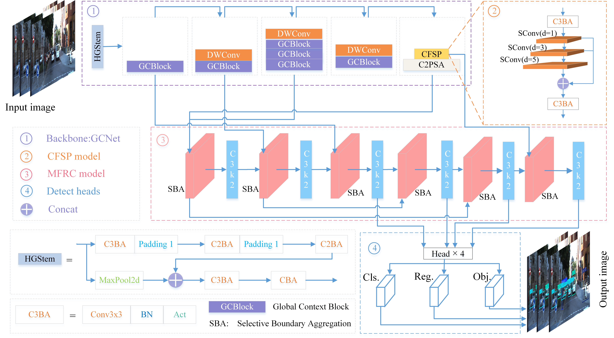
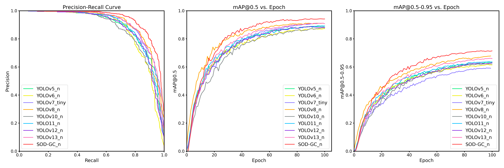

<h2 align="center">SOD-GC: Small Object Detector with Global Context and Multi-Scale Fusion for Traffic Scenes</h2>

<div align="center">
    
</div>
Fig. 1: The overall architecture of SOD-GC consists of three novel modules—Global Context Network(GCNet), Convolutional
Feature Space Pyramid(CFSP), and multi-scale feature fusion recalibration(MFRC)—that are intended to work under a variety
of traffic scenes.

## Table of Contents
- [Technical Briefing](#technical-briefing)
- [Main Results](#main-results)
  - [1. Comparative Analysis](#1-comparative-analysis)
  - [2. Small Object Detection Performance](#2-small-object-detection-performance)
  - [3. Visualization Results](#3-visualization-results)
- [Quick Start](#quick-start)
  - [1. Install Dependencies](#1-install-dependencies)
  - [2. Training](#2-training)

## Technical Briefing 💡

**We propose SOD-GC**, a novel network specifically designed to address the low detection accuracy of small objects in traffic scenes, as illustrated in Fig. 1. The design introduces three innovative modules:

- **GCNet**: Overcomes the limitations of traditional convolutional backbones in capturing global context. By leveraging Transformer-based feature extraction and contextual understanding, GCNet extracts richer and deeper representations and better comprehends object context.
- **CFSP**: Addresses the loss of detailed information typically caused by pooling operations in SPPF. By using a sequence of dilated convolutions with varying dilation rates, CFSP preserves multi-scale feature extraction capability while enhancing the capture of details.
- **MFRC**: Acts as the hub for multi-scale feature fusion and recalibration, promoting efficient interaction and optimal weighting between shallow and deep features. It recalibrates feature weights based on map resolution and content, significantly improving multi-scale fusion and small object detection precision.

## Main Results 🏆

### 1. Comparative Analysis
<div>
    
</div>

**Fig. 2:Training curves of SOD-GC compared to mainstream detectors on KITTI.**


### 2. Small Object Detection Performance
**Table 1: Small Object Detection Performance on KITTI Dataset**

| Method | mAP@0.5 | mAP@0.75 | mAP@0.5:0.95 | **APₛₘₐₗₗ** | APₘₑdᵢᵤₘ | APₗₐᵣgₑ | Params(M) | GFLOPs(G) |
|--------|---------|----------|--------------|--------------|-----------|-----------|------------|-----------|
| baseline_n | 88.62 | 68.24 | 59.46 | 36.52 | 61.20 | 71.12 | 2.58 | 6.3 |
| baseline_s | 93.08 | 74.49 | 66.02 | 41.82 | 68.44 | 78.29 | 9.42 | 21.3 |
| baseline_m | 94.98 | 77.11 | 67.88 | 44.43 | 69.92 | 78.43 | 20.04 | 67.7 |
| baseline_l | 94.72 | 80.56 | 69.77 | 46.13 | 71.40 | 81.07 | 25.28 | 86.6 |
| baseline_x | 95.28 | 80.00 | 69.84 | 47.28 | 71.68 | 80.44 | 56.84 | 194.4 |
| **SOD-GC_n** | **93.26** | **75.96** | **64.95** | **45.21 (+8.69)** | 65.87(+4.67) | 75.34(+4.22) | 5.48 | 21.0 |
| **SOD-GC_s** | **96.14** | **78.96** | **68.84** | **50.20 (+8.38)** | 69.92(+1.48) | 78.45(+0.16) | 20.80 | 71.0 |
| **SOD-GC_m** | **96.72** | **82.01** | **70.45** | **51.68 (+7.25)** | 71.92(+1.99) | 79.41(+0.98) | 37.36 | 181.9 |
| **SOD-GC_l** | **96.66** | **82.07** | **70.44** | **50.70 (+4.57)** | 72.04(+0.64) | 79.52(-1.55) | 51.71 | 223.8 |
| **SOD-GC_x** | **96.89** | **82.83** | **70.98** | **52.02 (+4.74)** | 72.14(+0.46) | 80.68(+0.24) | 115.43 | 494.5 |

**Table 2: Small Object Detection Performance on COCO-traffic Dataset**

| Method | mAP@0.5 | mAP@0.75 | mAP@0.5:0.95 | **APₛₘₐₗₗ** | APₘₑdᵢᵤₘ     | APₗₐᵣgₑ | Params(M) | GFLOPs(G) |
|--------|---------|----------|--------------|--------------|--------------|-----------|------------|-----------|
| baseline_n | 58.32 | 43.83 | 40.99 | 10.21 | 34.62        | 59.89 | 2.58 | 6.3 |
| baseline_s | 66.27 | 50.37 | 47.19 | 15.77 | 42.68        | 65.47 | 9.42 | 21.3 |
| baseline_m | 70.55 | 54.61 | 51.15 | 20.36 | 47.29        | 68.61 | 20.04 | 67.7 |
| baseline_l | 71.40 | 55.73 | 51.98 | 20.76 | 48.27        | 69.50 | 25.28 | 86.6 |
| baseline_x | 72.95 | 57.16 | 53.40 | 21.58 | 50.12        | 70.42 | 56.84 | 194.4 |
| **SOD-GC_n** | **61.53** | **47.33** | **44.06** | **12.68 (+2.47)** | 39.22(+4.60) | 62.31(+2.42) | 5.48 | 21.0 |
| **SOD-GC_s** | **68.45** | **52.86** | **49.44** | **18.96 (+3.19)** | 45.10(+2.42) | 66.33(+0.86) | 20.80 | 71.0 |
| **SOD-GC_m** | **71.69** | **56.15** | **52.32** | **22.63 (+2.27)** | 48.50(+1.21) | 68.49(-0.12) | 37.36 | 181.9 |
| **SOD-GC_l** | **71.86** | **56.50** | **52.62** | **23.11 (+2.35)** | 48.64(+0.37) | 68.87(-0.63) | 51.71 | 223.8 |
| **SOD-GC_x** | **74.43** | **59.17** | **54.97** | **26.01 (+4.43)** | 51.57(+1.45) | 70.67(+0.25) | 115.44 | 494.6 |

### 3. Visualization Results

<div>
    
</div>

**Fig. 3: Test results on the KITTI dataset.The first line is the result of the baseline detection,and the second line is the result
of our model detection.The green arrow marks the object that is not detected by the base_line algorithm.**

<div>
    
</div>

**Fig. 4: Test results on the VOC2007+2012 dataset.The first line is the result of the baseline detection, and the second line
is the result of our model detection.The green arrow marks the object that is not detected by the baseline algorithm.**

## Quick Start 🚀

### 1. Install Dependencies

```bash
git clone git@github.com:Lus-hub/SOD-GC.git
pip install
```

### 2. Training
```python
import warnings
warnings.filterwarnings('ignore')
from ultralytics import YOLO
if __name__ == '__main__':
    prefix = '***-'
    for yaml_name in ['SOD-GC']:
        model = YOLO(f'/***/{yaml_name}.yaml')
        model.train(data='/***/datasets/kitti.yaml',
                    # cache=False,
                    imgsz=640,
                    epochs=100,
                    batch=16,
                    close_mosaic=0,
                    workers=32,
                    device=0,
                    optimizer='SGD',  # using SGD
                    # patience=0, # set 0 to close earlystop.
                    # resume=True, 
                    # amp=False, # close amp
                    # fraction=0.2,
                    project='runs/train/',
                    name=f'{prefix}{yaml_name}',
                    # name='exp'
                    )
```